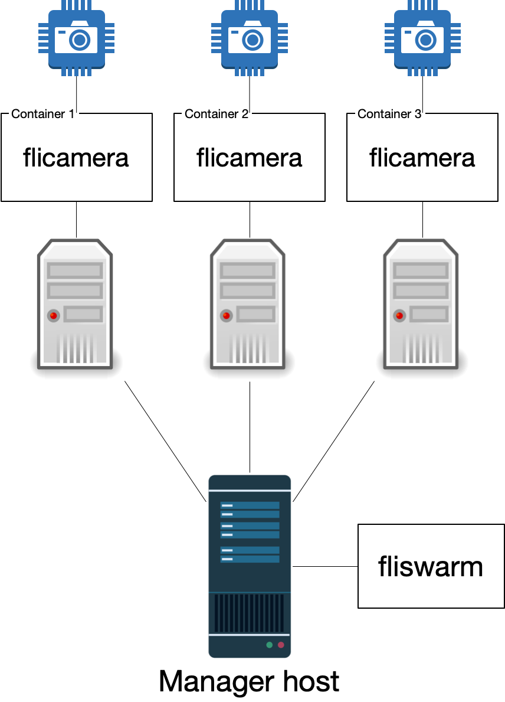

fliswarm's documentation
========================

This is the documentation for the SDSS Python product ``fliswarm``. The current version is |fliswarm_version|. You can install the package by doing

.. code-block:: console

  $ pip install sdss-fliswarm

Running fliswarm
----------------

To run the ``fliswarm`` actor as a daemon

.. code-block:: console

  $ fliswarm [-c config] start

where ``config`` is a configuration file for ``fliswarm``. If a configuration file is not provided, the `internal configuration <https://github.com/sdss/fliswarm/blob/main/fliswarm/etc/fliswarm.yaml>`__ will be used. The actor can be stopped with

.. code-block:: console

  $ fliswam stop

It's also possible to run the actor in non-detached mode with

.. code-block:: console

  $ fliswarm start --debug

To save the output of the process to a logfile you can do

.. code-block:: console

  $ fliswarm start --log <filename>

The actor can also be run by doing

.. code-block:: console

  $ module load fliswarm
  $ stageManager fliswarm start

How does fliswarm work?
-----------------------

``fliswarm`` provides an `actor <https://clu.readthedocs.io/en/latest/getting-started.html#introduction>`__-like interface to a set of `flicamera <https://github.com/sdss/flicamera>`_ instances, each running inside a Docker container in a different node computer. The following diagram shows a typical configuration

In this case we have three different node computers, each one with an attached camera that we want to control using ``flicamera``. A "manager" computer runs ``fliswarm``, which spins a Docker container in each one of the node computers. These containers run an image of ``flicamera`` that talks to its local camera. ``fliswarm`` connects to each one of the ``flicamera`` devices and manages the output, as well as submits commands to one or all the connected instances.

Why not Docker swarm?
^^^^^^^^^^^^^^^^^^^^^

The name ``fliswarm`` clearly points to `Docker swarm <https://docs.docker.com/engine/swarm/>`__ so, why not to use ``flicamera`` as a Docker service? The short answer is: that's the plan. However, at this time Docker services cannot be initiated in privileged mode, which is necessary for the flicamera container to access the node hardware. Once that changes, ``fliswarm`` will probably be rewritten to take advantage of the Docker swarm capabilities.

Setting up the manager and nodes
--------------------------------

Both the manager and node computers require a bit of special configuration before they can be used with ``fliswarm``. First, all computers need to be running a recent version of Docker Engine. All the Docker daemon services need to be accessible over TCP on port 2375. In most linux machines this can be achieved by editing ``/etc/docker/daemon.json`` and adding the content

.. code-block:: json

  {
    "hosts": ["tcp://0.0.0.0:2375", "unix:///var/run/docker.sock"]
  }

Then create the file ``/etc/systemd/system/docker.service.d/docker.conf`` with content ::

  [Service]
  ExecStart=
  ExecStart=/usr/bin/dockerd

and run ``sudo systemctl daemon-reload`` and ``sudo systemctl restart docker``. Follow `these instructions <https://docs.docker.com/config/daemon/>`__ for other systems.

The manager computer needs to run a local registry; details for setting one can be found `here <https://docs.docker.com/registry/deploying/>`__.

Finally, the node computers must be able to pull images from the local registry. If you haven't enabled certificates for the local registry, you'll need to configure the nodes to accept an insecure registry, as described `here <https://docs.docker.com/registry/insecure/>`__. In short, edit the ``/etc/docker/daemon.json`` file again and add

.. code-block:: json

  {
    "insecure-registries":["10.25.1.1:5000"],
  }

replacing ``10.25.1.1`` with the IP or hostname to the manager computer that is serving the registry. Then restart the Docker service.

.. note:: Enabling a local registry is only necessary to ensure that ``fliswarm`` can be run offline. If this is not a requirement it is possible to use a remote registry (for example the Docker Hub) by setting the configuration parameter ``registry`` to ``null``.

.. toctree::
  :maxdepth: 2
  :hidden:

  commands
  Low-level reference<api>
  Changelog <CHANGELOG>
